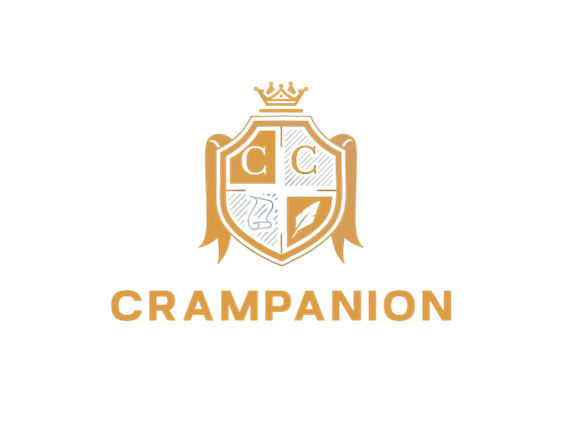
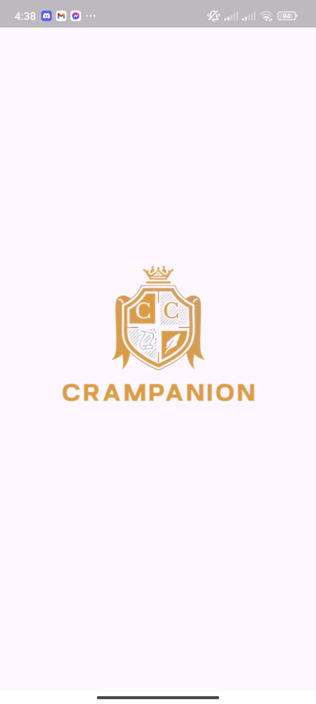
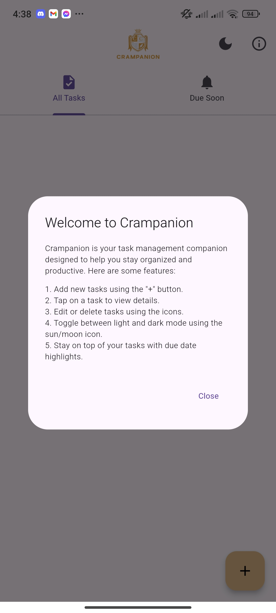
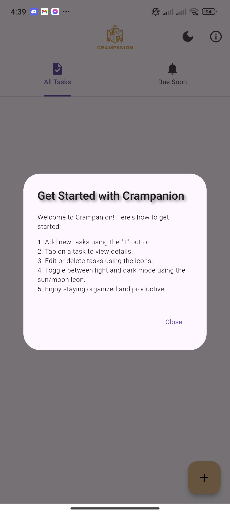
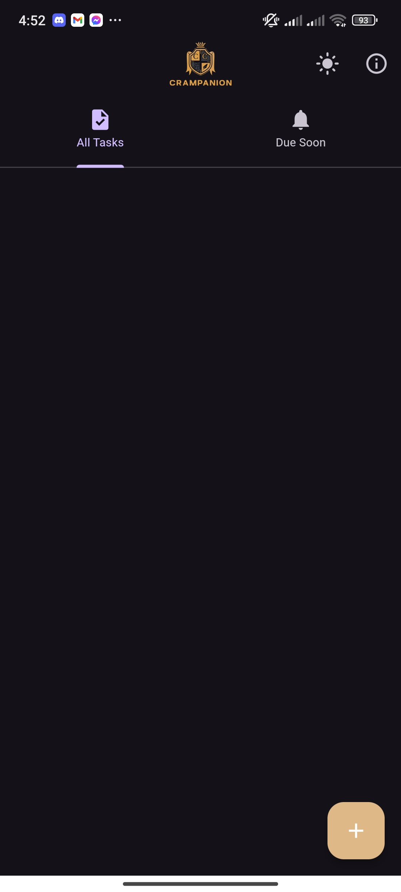
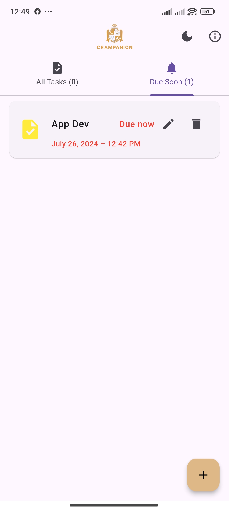
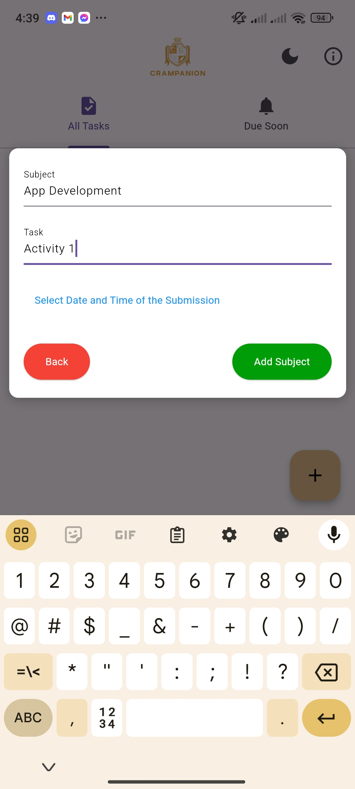
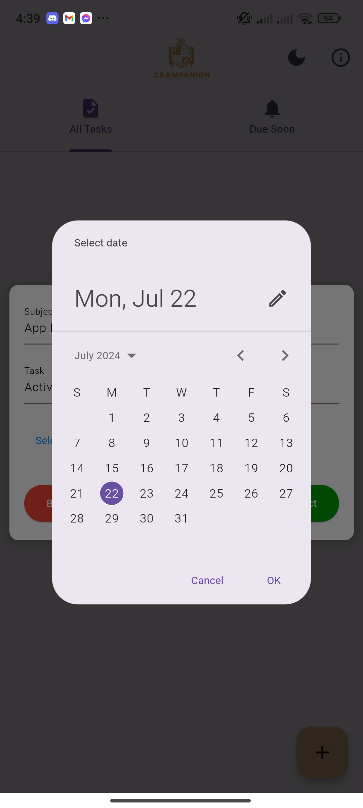
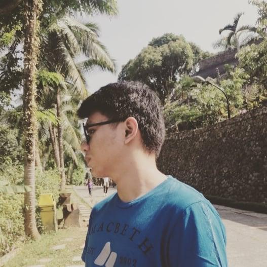

# Project In Application Development

**Crampanion Brainy Student Task Tamer**  
BSIT-3307

  The Crampanion Brainy Task Tamer is an mobile appplication that is designed specifically for students.It  
  is a mobile application that helps manage and organize their tasks, assignments, and deadlines effectively 
  by allowing them to create, edit, and delete tasks to set reminders. The main purpose and objective of this 
  mobile application is to assist students in managing their tasks and deadlines that they need to accomplish.

  

🛠️ Functionalities

&nbsp;&nbsp;&nbsp;&nbsp;&nbsp;&nbsp;  Create and Add a Student Task 
 &nbsp;&nbsp;&nbsp;&nbsp;&nbsp;&nbsp; Edit a Student Task 
 &nbsp;&nbsp;&nbsp;&nbsp;&nbsp;&nbsp; Read or View the Student Task 
 &nbsp;&nbsp;&nbsp;&nbsp;&nbsp;&nbsp;Delete a Student Task 

  
🎯 Sustainable Development Goals

  
  ### Goal 4 (SDG 4): Quality Education. 
  
  The Crampanion app for managing student tasks can be aligned with Sustainable Development Goal 4 (SDG 4): Quality Education. SDG 4 aims to ensure inclusive and equitable quality education and promote lifelong learning opportunities for all.
  
  By helping students manage their tasks effectively, the Crampanion app contributes to improving educational outcomes, reducing stress, and enhancing time management skills, all of which support the broader goals of quality education.

  
📱User Interface

  ## Splash Screen
&nbsp;&nbsp;&nbsp;&nbsp;&nbsp;&nbsp;&nbsp;&nbsp;&nbsp;&nbsp;&nbsp;&nbsp;&nbsp;&nbsp;&nbsp;&nbsp;&nbsp;&nbsp;&nbsp;&nbsp;&nbsp;&nbsp;&nbsp;&nbsp;&nbsp;&nbsp;&nbsp;&nbsp;&nbsp;&nbsp;&nbsp;&nbsp;&nbsp;&nbsp;&nbsp;&nbsp;&nbsp;&nbsp;&nbsp;&nbsp;&nbsp;&nbsp;&nbsp;&nbsp;&nbsp;&nbsp;&nbsp;&nbsp;&nbsp;&nbsp;&nbsp;&nbsp;&nbsp;

  ##  User Guide Dialog
  &nbsp; 
  &nbsp;&nbsp;&nbsp;*This is the user guide Dialog for the new user of the crampanion app*

   ## Task Screen
&nbsp;&nbsp;&nbsp;&nbsp;&nbsp;&nbsp;&nbsp;&nbsp;&nbsp;&nbsp;&nbsp;&nbsp;&nbsp;&nbsp;&nbsp;&nbsp;&nbsp;&nbsp;&nbsp;&nbsp;&nbsp;&nbsp;&nbsp;&nbsp;&nbsp;&nbsp;&nbsp;&nbsp;&nbsp;&nbsp;&nbsp;&nbsp;&nbsp;&nbsp;&nbsp;&nbsp;&nbsp;&nbsp;&nbsp;&nbsp;&nbsp;&nbsp;&nbsp;&nbsp;&nbsp;&nbsp;&nbsp;&nbsp;&nbsp;&nbsp;&nbsp;&nbsp;&nbsp;

&nbsp;&nbsp;&nbsp;&nbsp;&nbsp;&nbsp;&nbsp;&nbsp;&nbsp;&nbsp;&nbsp;&nbsp;&nbsp;&nbsp;&nbsp;&nbsp;&nbsp;&nbsp;*In this UI, you will see the subject of the task, the submission date, and the remaining days before the deadline.*

   ## Task Screen Tab
&nbsp; 
&nbsp;&nbsp;&nbsp;*The Task Screen has two tabs. The first tab is the 'All Tasks' tab, which displays tasks with deadlines that are two or more days away. In this tab, tasks are highlighted in green to indicate that the deadline is in the future. The second tab is the 'Due Soon' tab. This tab shows tasks that are either one day before the deadline or within 24 hours of it. You will also see that the text blinks red if the task's deadline is today.*
  ## UI for Adding a task Details
&nbsp; 
&nbsp;&nbsp;&nbsp;*In this dialog there is an input type where you can enter or add the details of your task you can also select a submission date for your task*
   ## Task Details
&nbsp; 

&nbsp;&nbsp;&nbsp;*In this UI you will see the details of your task that you have added inlcuding also the date you can also add edit and delete the details of your &nbsp;task*

👩‍💻 Developer
  
  &nbsp;&nbsp;&nbsp;&nbsp;&nbsp;&nbsp;&nbsp;&nbsp;&nbsp;&nbsp;&nbsp;&nbsp;&nbsp;&nbsp;&nbsp;&nbsp;&nbsp;&nbsp;&nbsp;
   <h5>&nbsp;&nbsp;&nbsp;&nbsp;&nbsp;&nbsp;&nbsp;&nbsp;&nbsp;&nbsp;&nbsp;&nbsp;&nbsp;&nbsp;&nbsp;&nbsp;&nbsp;&nbsp;&nbsp;&nbsp;&nbsp;&nbsp;&nbsp;&nbsp;&nbsp;&nbsp;&nbsp;&nbsp;&nbsp;&nbsp;Hawak Carl Jonel V. </h5>

      
        
    
 
&nbsp;&nbsp;&nbsp;&nbsp;&nbsp;&nbsp;&nbsp;&nbsp;&nbsp;&nbsp;&nbsp;&nbsp;&nbsp;&nbsp;&nbsp;&nbsp;&nbsp;&nbsp;&nbsp;
  <h5>&nbsp;&nbsp;&nbsp;&nbsp;&nbsp;&nbsp;&nbsp;&nbsp;&nbsp;&nbsp;&nbsp;&nbsp;&nbsp;&nbsp;&nbsp;&nbsp;&nbsp;&nbsp;&nbsp;&nbsp;&nbsp;&nbsp;&nbsp;&nbsp;&nbsp;&nbsp;Lagunsing John Carlo M. </h5>
        
      
        
  

&nbsp;&nbsp;&nbsp;&nbsp;&nbsp;&nbsp;&nbsp;&nbsp;&nbsp;&nbsp;&nbsp;&nbsp;&nbsp;&nbsp;&nbsp;&nbsp;&nbsp;&nbsp;&nbsp;    <h5>&nbsp;&nbsp;&nbsp;&nbsp;&nbsp;&nbsp;&nbsp;&nbsp;&nbsp;&nbsp;&nbsp;&nbsp;&nbsp;&nbsp;&nbsp;&nbsp;&nbsp;&nbsp;&nbsp;&nbsp;&nbsp;&nbsp;&nbsp;&nbsp;&nbsp;&nbsp;&nbsp;&nbsp;&nbsp;&nbsp;&nbsp;&nbsp;&nbsp;&nbsp;Luna Andrei B.</h5>
       
      
        
   

 🖥️ Programming Languages used and Frameworks
 
&nbsp;&nbsp;&nbsp;&nbsp;&nbsp;&nbsp;&nbsp;&nbsp;&nbsp;&nbsp;&nbsp;&nbsp;&nbsp;&nbsp;&nbsp;&nbsp;&nbsp;&nbsp;&nbsp;&nbsp;
&nbsp;&nbsp;

